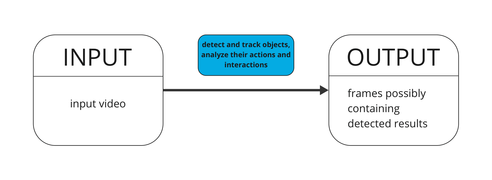
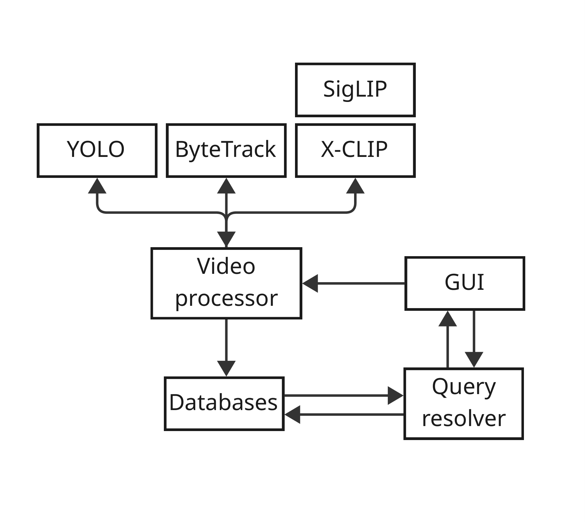
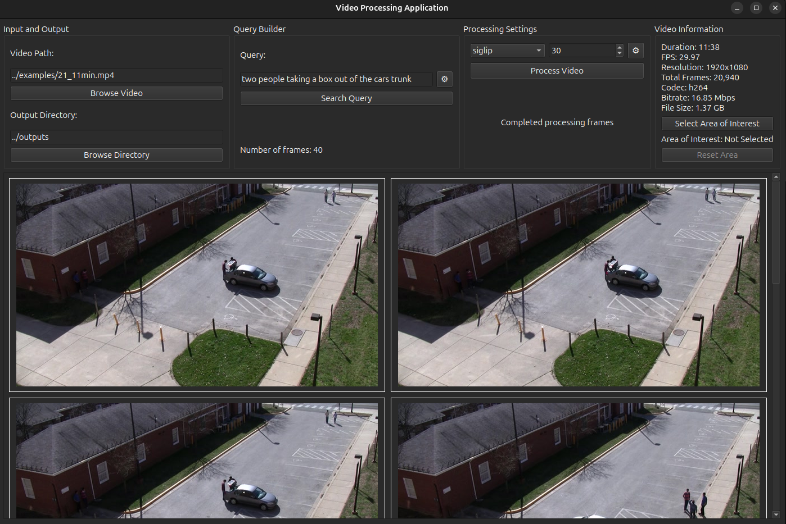
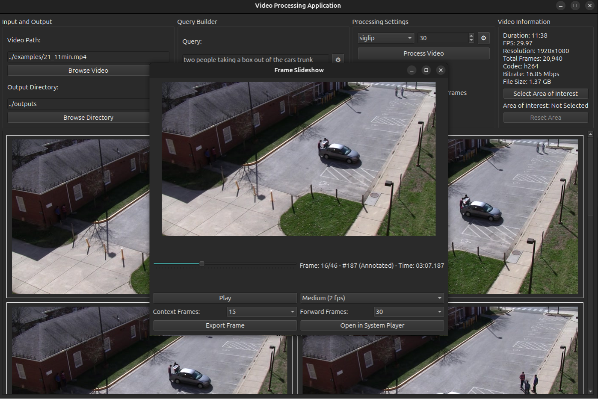

# Video Processing & Search System

**Author:** David Skalka

**Date:** 2025-05-07

**Description:** This repository implements the system designed as part of the thesis `Recognizing People and Their Activities in Video from Security Cameras` at the Faculty of Information Technology, Brno University of Technology. It provides an offline video indexing and search pipeline with a desktop UI, combining object detection, optional tracking, and vision-language embeddings for retrieval.

## Table of Contents
- Introduction
- Key Features
- Architecture Overview
- Core Components
- Data Storage
- Query Capabilities
- Diagrams
- Quick Start
  - System requirements
  - Virtual environment (dev)
  - Docker (optional)
- CLI Usage
- GUI Usage
- Usage Examples
- Configuration
- Models & Data
- Project Layout
- Troubleshooting
- Contributing
- License & Contact

## Introduction
This project implements a multi-stage video processing pipeline designed for efficient offline indexing and retrieval. It supports:

- detection-only indexing (YOLO)
- tracking-aware indexing (YOLO + ByteTrack)
- vision-language embedding indexing (X-CLIP / SigLIP)

The system stores per-frame and per-track metadata in SQLite and a local ChromaDB vector store to enable fast top-k retrieval for text and image-based queries. 
The primary workflow is driven from the desktop UI, which lets you select a video, configure processing parameters (frame interval, model choice, optional segmentation), and then run queries to inspect the indexed results.



## Key Features

- Fast frame extraction and batch processing using `ffmpeg` optimizations.
- Object detection (YOLOv11) with optional segmentation masks for color
  extraction.
- Multi-object tracking with ByteTrack to preserve identities across frames.
- Dominant color extraction per-object and simple motion-direction estimation.
- Vision-language embeddings with X-CLIP and SigLIP and cosine similarity
  search via ChromaDB.
- Lightweight UI for running queries and inspecting results (minimal
  dependency surface).
- Embedded storage (SQLite + Chroma) for reproducible, offline querying.

## Architecture Overview

The pipeline is intentionally modular and split into logical stages:

1. Ingestion & Preprocessing
  - Extracts frames using `ffmpeg`, supports adjustable frame-skip and time-range selection.
2. Detection (YOLO)
  - Runs a configured detection model; optionally produces segmentation masks for improved color computation.
3. Tracking (ByteTrack)
  - Associates detections across frames into tracks; saves per-track summaries (appearance, dominant colors, direction).
4. Embedding & Indexing (X-CLIP / SigLIP)
  - Computes vision-language embeddings for frames or track crops and stores vectors in ChromaDB for similarity search.
5. Query & UI
  - Parses queries into filters and displays matching frames in the UI.



## Core Components

- UI (PyQt6): main window, workers, and dialogs for processing and queries.
- Processing: `VideoProcessor` orchestrates extraction and model execution.
- Detection/Tracking: YOLOv11 and optional ByteTrack integration.
- Query parsing: query parsing and detection filtering in `parsers/`.
- Storage: SQLite for metadata and ChromaDB for vector embeddings.

## Data Storage

- SQLite stores structured metadata for videos, frames, detections, and
  tracking summaries.
- ChromaDB stores embedding vectors for similarity search in embedding modes.

For full code documentation see the generated docs in `docs/build/html`.

## Query Capabilities

Queries can filter by:

- Object classes (people, vehicles, and configured classes)
- Dominant color (optionally segmentation-aware)
- Motion direction (coarse directional estimates)
- Spatial relations (interaction and quadrant filters)

The UI writes annotated frames to the output directory and presents results
in a scrollable grid.


### GUI Overview



### GUI Frame Playback



## Quick Start

### System requirements

- Linux (Ubuntu 22.04+ recommended)
- Python 3.10+ (3.11 recommended)
- 8GB+ RAM recommended for model usage
- NVIDIA GPU recommended for inference (CUDA compatible)

### Virtual environment (development)

1. Install system prerequisites (example for Ubuntu):

```bash
sudo apt update
sudo apt install -y python3 python3-venv python3-pip ffmpeg sqlite3 \
    libxcb-cursor0 libxcb-xinerama0 libgl1-mesa-glx libglib2.0-0 \
    libsm6 libxrender1
```

2. Create and activate virtualenv:

```bash
cd /home/kraz/Documents/GitHub/video-detection-bp
python3 -m venv .venv
source .venv/bin/activate
```

3. Install Python dependencies:

```bash
pip install --upgrade pip
pip install -r requirements.txt
```

4. Run the application (example):

```bash
source .venv/bin/activate
python src/project/main.py --help
```

### Docker (optional)

There is a `Dockerfile` and `docker-compose.yaml` in the repository. They are
kept as optional convenience for containerized runs. If you plan to use GPU
acceleration in Docker, ensure your host has appropriate NVIDIA drivers and
`nvidia-docker` support.

## CLI Usage

These examples run the application from the command line. The main entry
point is `src/project/main.py`.

- Show available options:

```bash
python src/project/main.py --help
```

- Process a video with YOLO detections:

```bash
python src/project/main.py --input /path/to/video.mp4 --mode detect --output outputs/
```

- Run full pipeline (detection -> tracking -> embeddings):

```bash
python src/project/main.py --input /path/to/video.mp4 --mode full --output outputs/
```

## GUI Usage

1. Launch the app:

```bash
python src/project/main.py
```

2. Select a video file.
3. Choose a processing mode (YOLO, ByteTrack, X-CLIP, SigLIP).
4. Set the frame interval and optional segmentation settings.
5. Click **Process Video**.
6. Build a query and click **Search Query** to view results.

Screenshots:


## Usage Examples

- Process a single video for detection and indexing:

```bash
python src/project/main.py --input /path/to/video.mp4 --mode detect --output outputs/
```

- Run full pipeline (detection → tracking → embeddings):

```bash
python src/project/main.py --input /path/to/video.mp4 --mode full --output outputs/
```

Check `--help` for available CLI options and advanced flags.

## Configuration

Core runtime options live in `src/project/constants/constants.py` and the main
CLI. Typical runtime knobs:

- `frame_skip`: integer frames to skip between processed frames (higher =
  faster, less dense indexing).
- `detection_model`: path to YOLO weights (e.g., `src/yolo11n.pt`).
- `use_segmentation`: enable segmentation-based color extraction.
- `vector_store_path`: path to Chroma/SQLite files under `src/project/vector_database`.

## Models & Data

Pretrained model weights are expected in the repository under `src/` (e.g.
`yolo11n.pt`, `yolo11n-seg.pt`). The repo includes small sample weights for
development/CI. For production or higher-quality results, swap to full-sized
weights and ensure your environment (CUDA/cuDNN) is compatible.

## Project Layout

Key folders (under `src/project`):

- `detectors/` — detection models and wrappers (`yolo_detector.py`,
  `detection.py`).
- `database/` — SQLite wrappers and utilities.
- `vector_database/` — local ChromaDB files and management utilities.
- `interface/` — minimal UI and query workers.
- `parsers/` — detection/embedding parsers and helpers.
- `processors/` — `video_processor.py` and pipeline orchestration logic.
- `siglip/`, `xclip/` — model-specific embedding helpers.

## Troubleshooting

- Missing Qt plugin `xcb`: install `libxcb-cursor0` and `libxcb-xinerama0`.
- GPU not visible: verify `nvidia-smi` and `nvcc --version` and correct driver
  versions.
- If models fail to load on CPU-only hosts, install CPU builds of PyTorch and
  adjust model device flags.

## Contributing

Contributions are welcome. Suggested workflow:

1. Fork the repository and create a feature branch.
2. Run tests (if present) and linting.
3. Submit a pull request with a clear description and rationale.

If you want me to add a CONTRIBUTING.md or to wire up CI, tell me and I will
prepare a follow-up change.

## License & Contact

This project is provided as-is for research and development. Please refer to
project authorship and institutional guidelines before reuse. For questions or
collaboration, contact David Skalka.

## Acknowledgements

- Research and thesis supervision: Faculty of Information Technology, Brno
  University of Technology.
