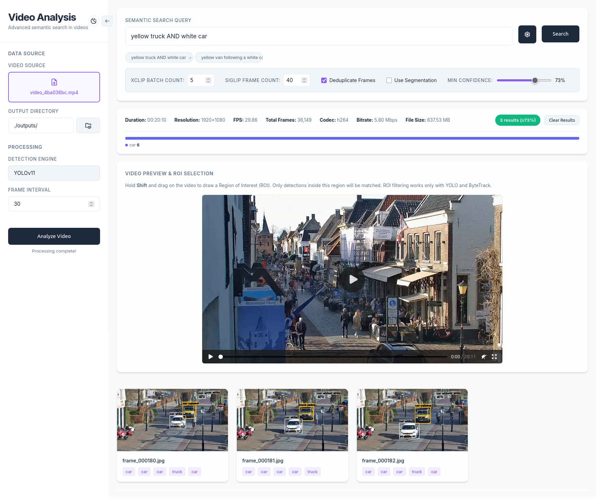
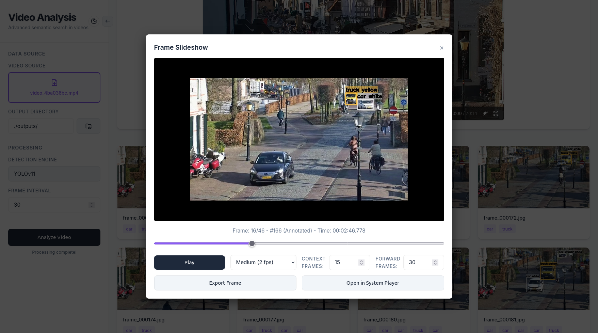

# Video Processing & Search System

**Author:** David Skalka

**Date:** 2025-05-07 (original) · 2026-06 (web UI redesign)

**Description:** An offline video indexing and search pipeline combining object detection, multi-object tracking, and vision-language embeddings. Originally built as a bachelor's thesis at Brno University of Technology, the project now ships with **two frontends**: the original standalone PyQt6 desktop app and a modern React + FastAPI web application.

## Table of Contents
- [Introduction](#introduction)
- [Key Features](#key-features)
- [Architecture Overview](#architecture-overview)
- [Running Modes](#running-modes)
- [Quick Start](#quick-start)
  - [System Requirements](#system-requirements)
  - [Python Environment Setup](#python-environment-setup)
  - [Mode A — Web Application (React + FastAPI)](#mode-a--web-application-react--fastapi)
  - [Mode B — Standalone Desktop App (PyQt6)](#mode-b--standalone-desktop-app-pyqt6)
  - [Docker (optional)](#docker-optional)
- [CLI Usage](#cli-usage)
- [Web App Usage](#web-app-usage)
- [Desktop App Usage](#desktop-app-usage)
- [Query Examples by Model](#query-examples-by-model)
- [Configuration](#configuration)
- [Project Layout](#project-layout)
- [Models & Data](#models--data)
- [Troubleshooting](#troubleshooting)
- [Known Issues](#known-issues)
- [Contributing](#contributing)
- [License & Contact](#license--contact)

## Introduction

This project implements a multi-stage video processing pipeline designed for efficient offline indexing and retrieval. It supports:

- Detection-only indexing (**YOLO**)
- Tracking-aware indexing (**YOLO + ByteTrack**)
- Vision-language embedding indexing (**X-CLIP / SigLIP**)

The system stores per-frame and per-track metadata in SQLite and a local ChromaDB vector store to enable fast top-k retrieval for text and image-based queries.


## Key Features

**Core Pipeline**
- Fast frame extraction and batch processing using `ffmpeg` optimizations
- Object detection (YOLOv11) with optional segmentation masks for color extraction
- Multi-object tracking with ByteTrack to preserve identities across frames
- Dominant color extraction per-object and simple motion-direction estimation
- Vision-language embeddings with X-CLIP and SigLIP via ChromaDB
- Embedded storage (SQLite + ChromaDB) for reproducible, offline querying

**Web Application (new)**
- Modern React frontend with glassmorphism design and dark/light themes
- Drag-and-drop video upload with interactive empty state
- Real-time processing progress via Server-Sent Events (SSE)
- Interactive ROI (Region of Interest) drawing directly on the video preview
- Detection statistics panel with class distribution breakdown
- Search history chips persisted in localStorage
- Result card hover previews with scale-up animation
- Skeleton loading states and toast notification system
- Collapsible sidebar that auto-expands on video upload
- Model-specific search placeholder examples

**Desktop Application (original)**
- PyQt6 desktop interface for local-only usage
- Frame slideshow with history/future playback
- Area-of-interest selector


## Architecture Overview

The pipeline is modular and split into logical stages:

1. **Ingestion & Preprocessing** — Extracts frames using `ffmpeg`, supports adjustable frame-skip and time-range selection.
2. **Detection (YOLO)** — Runs a configured detection model; optionally produces segmentation masks for improved color computation.
3. **Tracking (ByteTrack)** — Associates detections across frames into tracks; saves per-track summaries (appearance, dominant colors, direction).
4. **Embedding & Indexing (X-CLIP / SigLIP)** — Computes vision-language embeddings for frames or track crops and stores vectors in ChromaDB for similarity search.
5. **Query & UI** — Parses natural-language queries into filters and displays matching frames.

### Core Components

| Component | Description |
|-----------|-------------|
| `src/project/api/` | FastAPI backend — wraps the processing pipeline as REST endpoints |
| `frontend/` | React (Vite) web frontend |
| `src/project/interface/` | PyQt6 desktop UI (standalone mode) |
| `src/project/processors/` | `VideoProcessor` — orchestrates extraction and model execution |
| `src/project/parsers/` | Query parsing and detection filtering |
| `src/project/database/` | SQLite wrappers and utilities |
| `src/project/vector_database/` | ChromaDB vector store management |
| `src/project/detectors/` | YOLO detection and ByteTrack integration |
| `src/project/xclip/`, `siglip/` | Model-specific embedding helpers |

### Data Storage

- **SQLite** stores structured metadata for videos, frames, detections, and tracking summaries.
- **ChromaDB** stores embedding vectors for similarity search in embedding modes.

For full code documentation see the generated docs in `docs/build/html`.

## Running Modes

The application can be run in two modes:

| Mode | Frontend | Backend | Launch Command |
|------|----------|---------|----------------|
| **Web App** | React (Vite) on `localhost:5173` | FastAPI on `localhost:8000` | `./run_webapp.sh` |
| **Desktop App** | PyQt6 (standalone) | Built-in (same process) | `./entrypoint.sh` |

Both modes share the same processing pipeline, database, and AI models. The web app mode separates concerns into a proper frontend/backend architecture, while the desktop app runs everything in a single Python process.

## Quick Start

### System Requirements

- Linux (Ubuntu 22.04+ recommended)
- Python 3.10+ (3.11 recommended)
- Node.js 18+ and npm (for web app mode only)
- 8 GB+ RAM recommended for model usage
- NVIDIA GPU recommended for inference (CUDA compatible)

### Python Environment Setup

These steps are shared by both running modes:

1. Install system prerequisites (Ubuntu):

```bash
sudo apt update
sudo apt install -y python3 python3-venv python3-pip ffmpeg sqlite3 \
    libxcb-cursor0 libxcb-xinerama0 libgl1-mesa-glx libglib2.0-0 \
    libsm6 libxrender1
```

2. Create and activate a virtual environment:

```bash
python3 -m venv .venv
source .venv/bin/activate
```

3. Install Python dependencies:

```bash
pip install --upgrade pip
pip install -r requirements.txt
```

### Mode A — Web Application (React + FastAPI)

The web app runs the frontend and backend as two separate processes.

1. Install frontend dependencies (one-time):

```bash
cd frontend
npm install
cd ..
```

2. Launch both servers:

```bash
chmod +x run_webapp.sh
./run_webapp.sh
```

3. Open your browser at **http://localhost:5173**

The script starts:
- **FastAPI backend** on `http://localhost:8000` (with auto-reload)
- **Vite dev server** on `http://localhost:5173`

Press `Ctrl+C` to stop both servers.

**Manual startup** (if you prefer running them separately):

```bash
# Terminal 1 — Backend
source .venv/bin/activate
uvicorn src.project.api.main:app --reload --port 8000

# Terminal 2 — Frontend
cd frontend
npm run dev
```

### Mode B — Standalone Desktop App (PyQt6)

The original desktop application runs everything in a single process:

```bash
source .venv/bin/activate
chmod +x entrypoint.sh
./entrypoint.sh
```

### Docker (optional)

There is a `Dockerfile` and `docker-compose.yaml` in the repository. They are
kept as optional convenience for containerized runs. If you plan to use GPU
acceleration in Docker, ensure your host has appropriate NVIDIA drivers and
`nvidia-docker` support.

## CLI Usage

- Show available options:

```bash
python src/project/main.py --help
```

- Process a video with YOLO detections:

```bash
python src/project/main.py --input /path/to/video.mp4 --mode detect --output outputs/
```

- Run full pipeline (detection → tracking → embeddings):

```bash
python src/project/main.py --input /path/to/video.mp4 --mode full --output outputs/
```

## Web App Usage

1. Open **http://localhost:5173** after launching `./run_webapp.sh`.
2. **Upload a video** — drag and drop onto the central drop zone, or click to browse. The sidebar auto-expands once a video is loaded.
3. **Configure processing** — select a model (YOLO, ByteTrack, X-CLIP, SigLIP), set frame interval, and toggle segmentation in the sidebar.
4. Click **Analyze Video** to process. Real-time progress is shown via a progress bar and toast notifications.
5. **Search** — type a natural-language query in the search bar. The placeholder updates with example queries based on your selected model.
6. **Browse results** — hover over result cards for a preview, click to open the full frame slideshow.
7. **ROI filtering** — hold `Shift` and drag on the video preview to draw a Region of Interest. Only detections inside this region will be matched (YOLO/ByteTrack only).

Screenshots:




## Desktop App Usage

1. Launch the app with `./entrypoint.sh`.
2. Select a video file.
3. Choose a processing mode (YOLO, ByteTrack, X-CLIP, SigLIP).
4. Set the frame interval and optional segmentation settings.
5. Click **Process Video**.
6. Build a query and click **Search Query** to view results.

Screenshots:


To inspect a frame and its surrounding frames, click on it to open the slideshow:


## Query Examples by Model

Each processing model supports different types of natural-language queries:

| Model | Example Query | What It Matches |
|-------|---------------|-----------------|
| **YOLO** | `yellow truck and white car` | Frames containing both a yellow truck and a white car |
| **ByteTrack** | `white car going north` | Tracked white car with northward motion direction |
| **X-CLIP** | `person wearing a red jacket running` | Vision-language similarity match across frames |
| **SigLIP** | `person wearing a red jacket` | Per-frame vision-language embedding similarity |

Queries can filter by:
- Object classes (people, vehicles, and other configured COCO classes)
- Dominant color (optionally segmentation-aware)
- Motion direction (coarse directional estimates, ByteTrack only)
- Spatial relations (interaction and quadrant filters)

## Configuration

Core runtime options live in `src/project/constants/constants.py` and the main
CLI. Typical runtime knobs:

- `frame_skip`: integer frames to skip between processed frames (higher = faster, less dense indexing)
- `detection_model`: path to YOLO weights (e.g., `yolo11n.pt`)
- `use_segmentation`: enable segmentation-based color extraction
- `vector_store_path`: path to Chroma/SQLite files

## Project Layout

```
video-detection-bp/
├── frontend/                  # React (Vite) web frontend
│   ├── src/
│   │   ├── App.jsx            # Main application component
│   │   ├── FrameSlideshowModal.jsx
│   │   ├── ROIDrawer.jsx      # Region of Interest canvas overlay
│   │   ├── ToastProvider.jsx  # Global notification system
│   │   ├── DirectoryPickerModal.jsx
│   │   └── index.css          # Design system & all styles
│   └── package.json
├── src/project/
│   ├── api/                   # FastAPI backend
│   │   └── main.py            # REST endpoints for processing & search
│   ├── interface/             # PyQt6 desktop UI
│   ├── processors/            # Video processing pipeline
│   ├── parsers/               # Query parsing & detection filtering
│   ├── detectors/             # YOLO & ByteTrack wrappers
│   ├── database/              # SQLite wrappers
│   ├── vector_database/       # ChromaDB management
│   ├── xclip/                 # X-CLIP embedding helpers
│   └── siglip/                # SigLIP embedding helpers
├── run_webapp.sh              # Launch web app (frontend + backend)
├── entrypoint.sh              # Launch standalone desktop app
├── requirements.txt           # Python dependencies
└── README.md
```

## Models & Data

Pretrained model weights are expected in the repository root (e.g.
`yolo11n.pt`, `yolo11n-seg.pt`). The repo includes small sample weights for
development. For production or higher-quality results, swap to full-sized
weights and ensure your environment (CUDA/cuDNN) is compatible.

## Troubleshooting

- **Missing Qt plugin `xcb`**: install `libxcb-cursor0` and `libxcb-xinerama0`.
- **GPU not visible**: verify `nvidia-smi` and `nvcc --version` and correct driver versions.
- **CPU-only hosts**: install CPU builds of PyTorch and adjust model device flags.
- **Frontend not loading**: ensure Node.js 18+ is installed and `npm install` has been run in the `frontend/` directory.
- **Backend connection refused**: check that the FastAPI server is running on port 8000 and CORS is configured.

## Known Issues

- Extracting keywords from queries can sometimes fail if there are many different colors or objects mentioned. The system relies on keyword extraction that may not capture all relevant terms in complex queries (writing key terms in UPPERCASE can help).
- The Docker setup is not fully functional.

## Contributing

Contributions are welcome. Suggested workflow:

1. Fork the repository and create a feature branch.
2. Submit a pull request with a clear description and rationale.

## License & Contact

This project is provided as-is for research and development. Please refer to
project authorship and institutional guidelines before reuse.

## Acknowledgements

- Research and thesis supervision: Faculty of Information Technology, Brno
  University of Technology.
